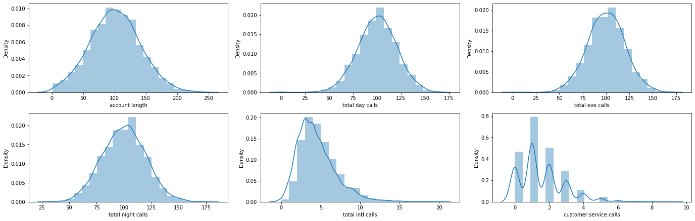
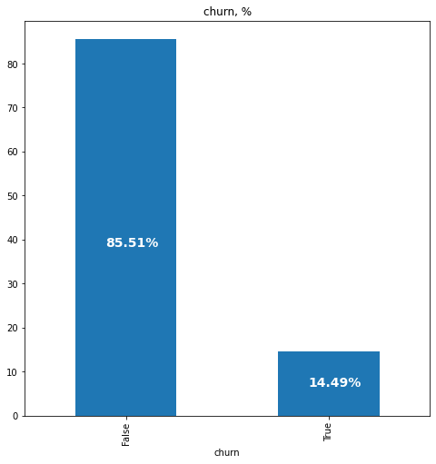
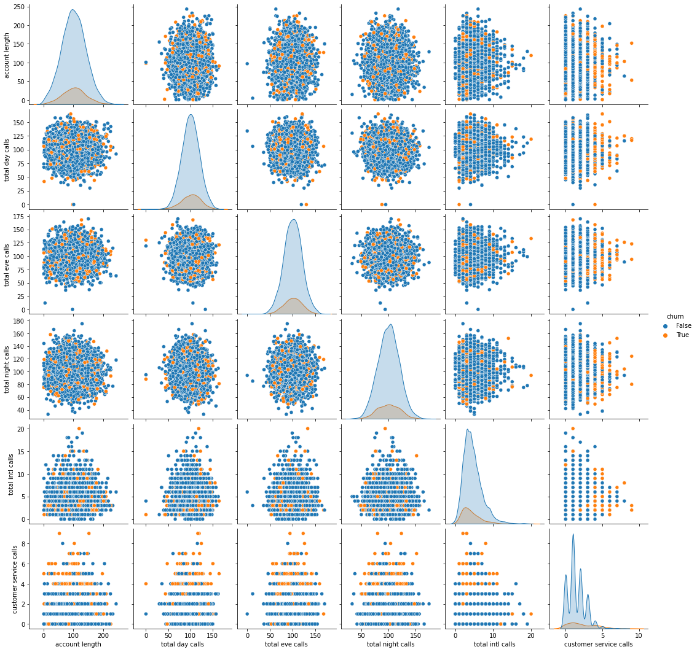
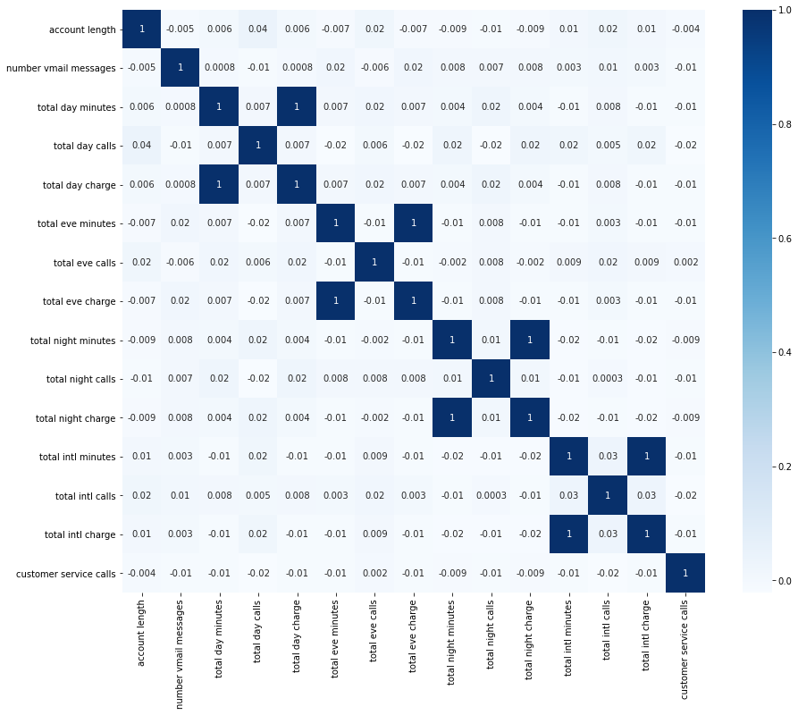
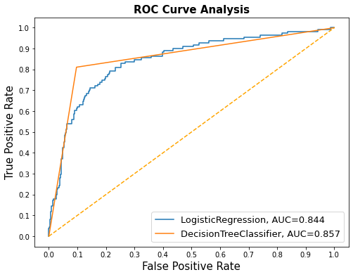

# TelecomChurnPredict-phase3

### Introduction
 One big challenge of the telecommunications sector is customer churn when customers decide to discontinue their services due to dissatisfaction or unfulfilled needs. For SyriaTel, where churn occurs mostly due to demographic factors, usage patterns, service interaction, and even payment history, it is thus important to understand these so as to formulate methodologies of improving customer satisfaction and retention. By identifying key indicators of churn, SyriaTel will have the necessary information to take the needed measures to resolve the problems before they cause loss of customers.

### Business Problem.
 SyriaTel can enhance its customer retention efforts by identifying key behavior indicators that signal susceptibility to churn, such as usage patterns, customer service interactions, payment history, and demographic information. Just as early intervention is crucial in healthcare, timely identification of at-risk customers enables SyriaTel to implement targeted retention strategies, improving customer satisfaction and loyalty. By leveraging predictive analytics, the company can reduce customer attrition, protect revenue streams, and make informed decisions about resource allocation, ultimately fostering a more stable customer base.

 ### Business Understanding
The objective is to build a classifier that predicts whether a customer will soon stop doing business with SyriaTel, addressing the critical issue of customer churn in the telecommunications industry. By analyzing customer demographics, usage patterns, service interactions, payment history, and contract details, SyriaTel aims to identify key indicators of churn. This predictive model will enable the company to proactively engage at-risk customers with targeted retention strategies, ultimately reducing financial losses and enhancing customer satisfaction and loyalty. Leveraging these insights will support SyriaTel in maintaining a stable revenue stream and fostering sustainable growth in a competitive market.

### Data Understanding 

 The dataset used in this project is sourced from here: https://www.kaggle.com/datasets/becksddf/churn-in-telecoms-dataset

 The data for predicting customer churn at SyriaTel encompasses a broad array of attributes: demographic, usage pattern, service interaction, payment history, and contract. It's important to understand the completeness, consistency, and relevance of this data to bring out the patterns that relate to churn risk. It analyzes these factors to come up with a predictive model for SyriaTel that will highlight the at-risk customers accurately for the purpose of retention strategies and improvement of customer satisfaction and loyalty.

 ### Data Analysis and Data Preparation
Before performing exploratory analysis and modelling on the data certain issues such as missing values and duplicates have to be handled first.
####  Distrubution Plots for Numeric Features

### Distribution of churn

The dataset is unbalanced with only 14.49% of objects belonging to class 1

#### How the number of customer service calls affects churn

There seems to be a evident relationship between customer service calls and true churn values. After 4 calls, customers are a lot more likely to discontinue their service.

#### Correlation Heatmap for Numeric Features

Most of the features are not correlated however some do share a perfect correlation.
It makes sense for these features to be perfectly correlated because the charge is a direct result of the minutes used.
The perfect correlation of 1 indicates the presence of perfect multicollinearity. It does not have the same impact on nonlinear models as it does on linear models. Some nonlinear models are impacted by perfect multicollinearity whereas others are not.

### Model 1 - Logistic Regression Classifier

Logistic regression is a classification algorithm, used when the value of the target variable is categorical in nature.
    LOGISTIC REGRESSION CLASSIFIER MODEL RESULTS 
        Accuracy score for testing set:  0.77938
        F1 score for testing set:  0.48889
        Recall score for testing set:  0.79279
        Precision score for testing set:  0.35341

According to the logistic regression classifier model, total day charge, ,total day minutes and international plan are the top three important features.

Model accuracy is 77.9%, which indicates that the model correctly predicts the outcome about 77.9% of the time. However, the F1 score is only 49%, suggesting that the model struggles to balance precision and recall effectively. This means that while the model may identify some positive cases, it is likely to produce a significant number of false positives and false negatives, leading to less reliable predictions overall.

### Model 2 - Decision Tree Classifier
Decision Tree is a Supervised learning technique that can be used for both classification and Regression problems, but mostly it is preferred for solving Classification problems. It is a tree-structured classifier, where internal nodes represent the features of a dataset, branches represent the decision rules and each leaf node represents the outcome.

It is called a decision tree because, similar to a tree, it starts with the root node, which expands on further branches and constructs a tree-like structure.

Decision Trees usually mimic human thinking ability while making a decision, so it is easy to understand.

The logic behind the decision tree can be easily understood because it shows a tree-like structure.

    DECISION TREE CLASSIFIER MODEL RESULTS  
        Accuracy score for testing set:  0.89808
        F1 score for testing set:  0.67925
        Recall score for testing set:  0.81081
        Precision score for testing set:  0.58442
The model exhibits strong accuracy(0.89808) and recall(0.81081), indicating it is effective at identifying positive cases. However, the relatively low precision(0.58442) highlights a challenge with false positives. To enhance the model's performance, particularly in precision, further tuning and optimization may be necessary. Balancing these metrics will be crucial, especially in contexts where the cost of false positives is high.

### Models Comparison
#### ROC Curve
This is a Receiver Operating Characteristic (ROC) curve analysis for two classification models: Logistic Regression and Decision Tree Classifier.

The ROC curve and AUC values suggest that both the Logistic Regression and Decision Tree Classifier models exhibit good performance in classifying positive and negative instances. The Decision Tree Classifier demonstrates a slightly better performance with a higher AUC value, indicating a better ability to distinguish between the classes.

# Conclusion
#### Decision Tree Classsifier
The Decision Tree Classifier achieved an accuracy of 0.89808153, indicating that it correctly classified approximately 90% of the samples in the dataset. The classification report provides a more detailed breakdown of the model's performance.

The model exhibits strong accuracy(0.89808) and recall(0.81081), indicating it is effective at identifying positive cases. However, the relatively low precision(0.58442) highlights a challenge with false positives. To enhance the model's performance, particularly in precision, further tuning and optimization may be necessary. Balancing these metrics will be crucial, especially in contexts where the cost of false positives is high.
#### Logistic regression
According to the logistic regression classifier model, total day charge, ,total day minutes and international plan are the top three important features.

Model accuracy is 77.9%, which indicates that the model correctly predicts the outcome about 77.9% of the time. However, the F1 score is only 49%, suggesting that the model struggles to balance precision and recall effectively. This means that while the model may identify some positive cases, it is likely to produce a significant number of false positives and false negatives, leading to less reliable predictions overall.